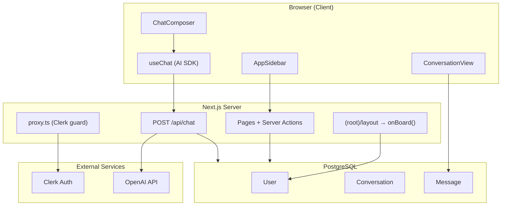
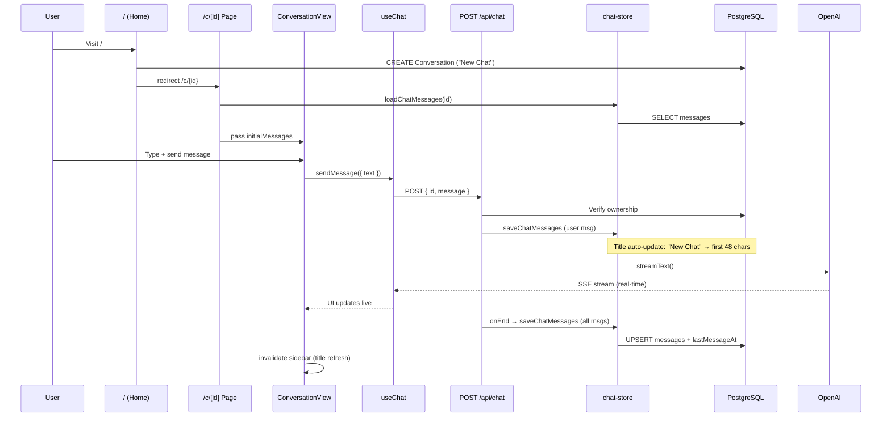
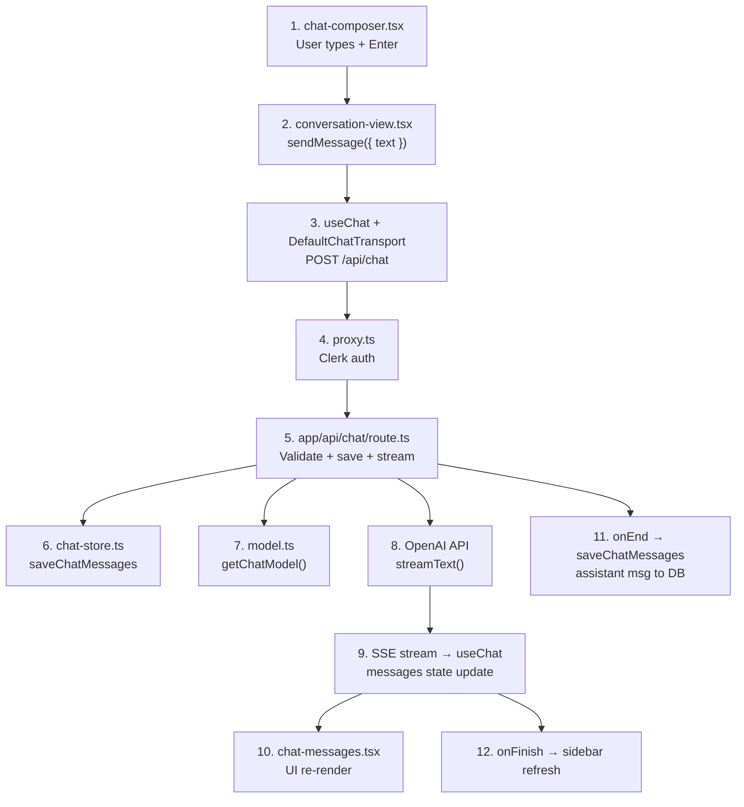

# ChaiGPT

ChaiGPT is a **Next.js 16 App Router** chat application with **Clerk** authentication, **PostgreSQL + Prisma 7** persistence, and **Vercel AI SDK** streaming responses.

---

## Tech Stack

| Layer | Technology |
|-------|------------|
| Framework | Next.js 16, React 19, TypeScript |
| Auth | Clerk (`@clerk/nextjs`) |
| Database | PostgreSQL + Prisma 7 (`@prisma/adapter-pg`) |
| AI | Vercel AI SDK (`ai`, `@ai-sdk/react`, `@ai-sdk/openai`) |
| Data fetching (client) | TanStack React Query |
| UI | Tailwind v4, Base UI, shadcn components |

---

## Project Structure

```
chaigpt/
├── app/                    → Routes, layouts, API
│   ├── layout.tsx          → Root: Clerk, Theme, React Query
│   ├── (root)/             → Authenticated app (sidebar + chat)
│   │   ├── layout.tsx      → auth.protect + onBoard + ChatShell
│   │   ├── page.tsx        → / → create chat → redirect
│   │   └── c/[id]/page.tsx → /c/:id → chat UI
│   ├── sign-in/            → Clerk login (public)
│   └── api/chat/route.ts   → AI streaming endpoint
├── features/               → Domain logic (feature-based)
│   ├── auth/               → onBoard, requireUser
│   ├── home/               → startNewChat
│   ├── conversation/       → sidebar, chat UI, CRUD
│   ├── messages/           → CRUD hooks (not wired into UI yet)
│   └── ai/                 → chat-store, model config
├── components/             → Shared UI (ui/, ai-elements/, providers/)
├── lib/                    → db.ts, utils, generated Prisma client
├── prisma/                 → schema + migrations
└── proxy.ts                → Route protection (Next.js 16 middleware)
```

---

## High-Level Architecture



---

## Authentication Flow

Auth is enforced in three layers:

### 1. `proxy.ts` — Global Gatekeeper

Only `/sign-in` is public. All other routes and API routes require a Clerk session.

```ts
const isPublicRoute = createRouteMatcher(['/sign-in(.*)'])

export default clerkMiddleware(async (auth, req) => {
  if (!isPublicRoute(req)) {
    await auth.protect()
  }
})
```

### 2. Root Layout — Providers

`app/layout.tsx` wraps the app with `ClerkProvider`, `QueryProvider`, and `ThemeProvider`.

### 3. Authenticated Layout — DB Sync

When a user enters the `(root)` route group:

1. `auth.protect()` — ensure Clerk session
2. `onBoard()` — upsert Clerk user into Prisma `User` table
3. Render `ChatShell` (sidebar + main content)

**Key auth helpers:**

| Function | File | Purpose |
|----------|------|---------|
| `onBoard()` | `features/auth/action/onboard.ts` | Sync Clerk user → Prisma |
| `requireUser()` | `features/auth/action/require-user.tsx` | Auth + fetch Prisma user (used in actions/API) |

Sign-in lives at `/sign-in` with Clerk `<SignIn routing="hash" />` to keep a clean URL.

---

## Database Schema

```
User (1) ──── (*) Conversation (1) ──── (*) Message
```

| Model | Key Fields | Purpose |
|-------|-----------|---------|
| **User** | `clerkId`, `email`, `firstName` | Synced from Clerk |
| **Conversation** | `title`, `model`, `systemPrompt`, `isPinned`, `lastMessageAt` | Each chat thread |
| **Message** | `role`, `content`, `parts` (JSON), `status` | User/assistant messages |

- `parts` stores AI SDK structured message parts (text, images, etc.)
- `model` and `systemPrompt` support per-conversation overrides (schema ready; UI not exposed yet)

**DB client** (`lib/db.ts`): Prisma 7 with `@prisma/adapter-pg`, singleton pattern for dev hot-reload.

---

## Routing & Pages

| URL | File | Behavior |
|-----|------|----------|
| `/` | `app/(root)/page.tsx` | `startNewChat()` → create conversation → `redirect(/c/{id})` |
| `/c/[id]` | `app/(root)/c/[id]/page.tsx` | Verify conversation → load messages → render `ConversationView` |
| `/sign-in` | `app/sign-in/[[...sign-in]]/page.tsx` | Clerk login UI |
| `POST /api/chat` | `app/api/chat/route.ts` | Stream AI response |

---

## UI Shell

```
ChatShell
├── AppSidebar (left)
│   ├── Logo → /
│   ├── "New Chat" button → /
│   ├── Conversation list (React Query)
│   └── Theme toggle + UserButton
└── SidebarInset (right)
    └── Page content (ConversationView)
```

**`ConversationView`** is the main chat screen:

- **Header** — conversation title
- **Body** — `ChatEmpty` or `ChatMessages`
- **Footer** — `ChatComposer` (textarea + send)
- Uses `useChat` from `@ai-sdk/react` with `DefaultChatTransport` → `POST /api/chat`

---

## Complete Chat Flow



### Step-by-step

1. **Start a new chat** — User visits `/` or clicks "New Chat" in the sidebar. `startNewChat()` creates a `Conversation` with title `"New Chat"` and redirects to `/c/{id}`.

2. **Load chat page** — `getConversation(id)` verifies ownership. `loadChatMessages(id)` loads prior messages as AI SDK `UIMessage[]`. `ConversationView` receives `initialMessages`.

3. **Send a message** — User types in `ChatComposer` and submits. `useChat` POSTs to `/api/chat` with `{ id: conversationId, message: lastMessage }`.

4. **API route** (`app/api/chat/route.ts`):
   - Auth + ownership check
   - Save user message immediately (with dedup logic)
   - Auto-title: `"New Chat"` → first 48 characters of the first user message
   - Call OpenAI via `streamText()` (default model: `gpt-4o-mini`)
   - Stream response to client via SSE
   - On stream end, upsert all messages to the database

5. **UI update** — `useChat` renders the stream in real time. On finish, sidebar conversation list is invalidated so the updated title appears.

---

## File-wise Message Flow (Send → Response)

When you are on `/c/[id]` and send a message, these files run **in order**.

### Page setup (before you type)

| File | What runs |
|------|-----------|
| `proxy.ts` | Clerk session check — no login, no API/page access |
| `app/(root)/layout.tsx` | `auth.protect()` + `onBoard()` → user synced to DB |
| `app/(root)/c/[id]/page.tsx` | Verify conversation + load prior messages |

```ts
// app/(root)/c/[id]/page.tsx
await getConversation(id)           // conversation-actions.tsx — ownership check
const initialMessages = await loadChatMessages(id)  // chat-store.ts — DB → UIMessage[]

return (
  <ConversationView
    conversationId={id}
    initialMessages={initialMessages}
  />
)
```

Then `ConversationView` mounts in the browser with `initialMessages`.

### Send message → get response



---

### Step 1 — User types a message

**File:** `features/conversation/components/chat-composer.tsx`

Input UI only. On Enter / submit:

```ts
async function handleSubmit(event?: React.FormEvent) {
  event?.preventDefault();
  const content = value.trim();
  if (!content || isSending) return;

  setValue("");
  await onSend(content);  // passed from parent
}
```

- Reads text from textarea
- Returns early if empty or already sending
- Clears input and calls **`onSend(content)`** (defined in parent)

---

### Step 2 — `sendMessage` is triggered

**File:** `features/conversation/components/conversation-view.tsx`

Client-side chat brain.

**Setup (once on page load):**

```ts
const transport = useMemo(() => new DefaultChatTransport({
  api: "/api/chat",
  prepareSendMessagesRequest: ({ id, messages }) => ({
    body: { id, message: messages.at(-1) }
  })
}), []);

const { messages, sendMessage, status } = useChat({
  id: conversationId,
  messages: initialMessages,
  transport,
  onFinish: () => {
    void queryClient.invalidateQueries({ queryKey: queryKeys.conversations.all });
  },
  onError: (error) => toast.error(error.message),
});
```

- `useChat` — AI SDK hook; manages `messages` state
- `DefaultChatTransport` — sends API call to `/api/chat`
- Body contains only **`id`** (conversationId) and **`message`** (last message)

**When user sends:**

```ts
<ChatComposer
  onSend={(text) => { void sendMessage({ text }); }}
  isSending={status !== "ready"}
/>
```

Inside `sendMessage({ text })`, the AI SDK:

1. Adds a new **user message** to the `messages` array
2. Sets `status` → `"submitted"`
3. Sends `POST /api/chat` with body:
   ```json
   {
     "id": "conversation-id",
     "message": { "id": "...", "role": "user", "parts": [{ "type": "text", "text": "hello" }] }
   }
   ```

---

### Step 3 — UI updates immediately (user message visible)

**File:** `features/conversation/components/chat-messages.tsx`

Re-renders when `useChat` updates `messages`:

```ts
const isWaiting = status === "submitted" && messages.at(-1)?.role === "user";

// Renders all messages
{messages.map((message) => (
  <Message key={message.id} from={message.role}>
    <MessageContent>
      <MessageResponse>{getMessageText(message)}</MessageResponse>
    </MessageContent>
  </Message>
))}

// Shows loader while waiting for assistant
{isWaiting ? <Loader /> : null}
```

- User message appears in the list
- If `status === "submitted"` and last message is from user → **Loader** (waiting indicator)

---

### Step 4 — Request hits the server (auth)

**File:** `proxy.ts`

Every request (including `POST /api/chat`) passes through here first:

```ts
export default clerkMiddleware(async (auth, req) => {
  if (!isPublicRoute(req)) {
    await auth.protect()
  }
})
```

Not logged in → request blocked before reaching the API.

---

### Step 5 — API route: main server logic

**File:** `app/api/chat/route.ts`

Handles message persistence and AI streaming.

#### 5a. Auth + parse body

```ts
await auth.protect();
const { message, id } = await req.json();
if (!message || !id) return new Response("Missing message or conversation id", { status: 400 });
```

#### 5b. Verify user + conversation ownership

```ts
const user = await requireUser();  // features/auth/action/require-user.tsx

const conversation = await prisma.conversation.findFirst({
  where: { id, userId: user.id }
});
if (!conversation) return new Response("Conversation not found", { status: 404 });
```

- **`require-user.tsx`** — finds Prisma `User` from Clerk ID
- **`lib/db.ts`** — Prisma client for DB queries

#### 5c. Load chat history

```ts
const previousMessages = await loadChatMessages(id);
const alreadySaved = previousMessages.some((m) => m.id === message.id);
const messages = alreadySaved ? previousMessages : [...previousMessages, message];
```

- **`features/ai/actions/chat-store.ts`** → `loadChatMessages()` fetches prior messages from DB

#### 5d. Save user message to DB (immediately)

```ts
if (!alreadySaved) {
  await saveChatMessages(id, [message]);
}
```

**File:** `features/ai/actions/chat-store.ts` — `saveChatMessages()`

- Upserts message into `Message` table (`content`, `parts`, `role`, `status`)
- Updates `lastMessageAt` on the conversation
- Auto-titles: `"New Chat"` → first 48 characters of the first user message

---

### Step 6 — Call OpenAI + start stream

**File:** `app/api/chat/route.ts`

```ts
const result = streamText({
  model: getChatModel(conversation.model),
  system: conversation.systemPrompt ?? "You are ChaiGpt , a helpful assistant",
  messages: await convertToModelMessages(messages),
});
result.consumeStream();
```

**File:** `features/ai/utils/model.ts`

```ts
export function getChatModel(modelId?: string | null) {
  return openai(modelId || DEFAULT_CHAT_MODEL)  // default: gpt-4o-mini
}
```

- `convertToModelMessages()` — AI SDK format → OpenAI format
- `streamText()` — **streaming** response from OpenAI

---

### Step 7 — Stream response to client (SSE)

**File:** `app/api/chat/route.ts`

```ts
return createUIMessageStreamResponse({
  stream: toUIMessageStream({
    stream: result.stream,
    originalMessages: messages,
    generateMessageId: createIdGenerator({ prefix: "msg", size: 16 }),
    onEnd: async ({ messages: finalMessages }) => {
      await saveChatMessages(id, finalMessages, { updateTitle: false });
    }
  })
});
```

- Response is a **Server-Sent Events (SSE)** stream
- Chunks are sent to the browser as they arrive
- **`onEnd`** — when stream finishes, saves all messages (user + assistant) to DB
  - `{ updateTitle: false }` — title is not changed again

---

### Step 8 — Browser receives stream + UI updates

**File:** `features/conversation/components/conversation-view.tsx` (`useChat` internally)

The AI SDK (`@ai-sdk/react`) receives stream chunks and:

1. Adds/updates the **assistant message** in `messages`
2. Sets `status` → `"streaming"` → then `"ready"`
3. Re-renders `ChatMessages` on each chunk → text appears **live**

**File:** `features/conversation/components/chat-messages.tsx`

- Assistant reply rendered with markdown (`MessageResponse`)
- Loader disappears when stream completes

---

### Step 9 — Stream complete → sidebar refresh

**File:** `features/conversation/components/conversation-view.tsx`

```ts
onFinish: () => {
  void queryClient.invalidateQueries({ queryKey: queryKeys.conversations.all });
}
```

- React Query refetches the conversation list
- Sidebar shows updated title (if it was the first message)

**File:** `features/conversation/components/app-sidebar.tsx` — list refreshes.

---

### File order summary (one message)

| # | File | Role |
|---|------|------|
| 1 | `chat-composer.tsx` | User input → `onSend(text)` |
| 2 | `conversation-view.tsx` | `sendMessage({ text })` → API call setup |
| 3 | `@ai-sdk/react` (`useChat`) | Add user msg to state → POST request |
| 4 | `chat-messages.tsx` | Show user msg + loader |
| 5 | `proxy.ts` | Clerk auth check |
| 6 | `app/api/chat/route.ts` | Main handler |
| 7 | `require-user.tsx` | Verify DB user |
| 8 | `lib/db.ts` | Prisma → PostgreSQL |
| 9 | `chat-store.ts` | Save user msg + load history |
| 10 | `model.ts` | Select OpenAI model |
| 11 | OpenAI API | Generate AI response |
| 12 | `app/api/chat/route.ts` | Return SSE stream |
| 13 | `useChat` (client) | Receive stream → update `messages` |
| 14 | `chat-messages.tsx` | Render assistant response live |
| 15 | `chat-store.ts` | `onEnd` — save assistant msg to DB |
| 16 | `conversation-view.tsx` | `onFinish` — refresh sidebar |

### Simple timeline

```
User types "Hello"
    ↓
chat-composer.tsx → onSend("Hello")
    ↓
conversation-view.tsx → sendMessage({ text: "Hello" })
    ↓
useChat → add user msg to messages[] + POST /api/chat
    ↓
chat-messages.tsx → show "Hello" + Loader
    ↓
proxy.ts → auth OK?
    ↓
route.ts → verify user → load history → save user msg to DB
    ↓
model.ts → gpt-4o-mini → streamText() → OpenAI
    ↓
route.ts → send SSE stream chunks
    ↓
useChat → receive chunks → build assistant msg
    ↓
chat-messages.tsx → show response live
    ↓
route.ts onEnd → save assistant msg to DB
    ↓
conversation-view onFinish → refresh sidebar title
```

---

## Data Persistence (`features/ai/actions/chat-store.ts`)

| Function | Purpose |
|----------|---------|
| `loadChatMessages(id)` | DB → AI SDK `UIMessage[]` (oldest first) |
| `saveChatMessages(id, messages)` | AI SDK messages → DB upsert + `lastMessageAt` update |

Messages are stored with:

- `content` — plain text
- `parts` — structured JSON (AI SDK format)
- `role` — `USER` / `ASSISTANT`
- `status` — `COMPLETE`

---

## Server Actions & Hooks

### Server Actions

| Action | File | Used By |
|--------|------|---------|
| `onBoard()` | `features/auth/action/onboard.ts` | Root layout |
| `requireUser()` | `features/auth/action/require-user.tsx` | Actions, API routes |
| `startNewChat()` | `features/home/actions/start-new-chat.ts` | Home page |
| `getConversation`, `listConversations`, etc. | `features/conversation/actions/conversation-actions.tsx` | Sidebar, pages |
| `loadChatMessages`, `saveChatMessages` | `features/ai/actions/chat-store.ts` | Page + API |

### Client Hooks

| Hook | Used By | Status |
|------|---------|--------|
| `useConversations()` | Sidebar | Active |
| `useUpdateConversation()` | Sidebar (rename/pin) | Active |
| `useDeleteConversation()` | Sidebar | Active |
| `useChat()` (AI SDK) | ConversationView | Active |
| `useMessages()` etc. | — | Not wired into UI yet |

---

## Notable Observations

1. **Two message systems** — The active path is AI SDK + `chat-store.ts`. `features/messages/` CRUD exists but is not integrated into `ConversationView`.

2. **`useCreateConversation` is unused** — New chats always go through the `startNewChat()` server action on `/`, not a client mutation.

3. **Per-conversation AI config is schema-ready** — `model` and `systemPrompt` fields exist and the API uses them; the UI does not expose model selection yet.

4. **Next.js 16 convention** — Route protection lives in `proxy.ts` (not `middleware.ts`).

---

## Getting Started

### Prerequisites

- Node.js 20.19+ (project pins Node 22 via `.nvmrc`)
- pnpm
- PostgreSQL database

### Environment Variables

```env
DATABASE_URL=postgresql://...
NEXT_PUBLIC_CLERK_PUBLISHABLE_KEY=...
CLERK_SECRET_KEY=...
OPENAI_API_KEY=...
```

### Install & Run

```bash
pnpm install
pnpm exec prisma migrate dev
pnpm dev
```

Open [http://localhost:3000](http://localhost:3000). Unauthenticated users are redirected to `/sign-in`.

### Other Scripts

```bash
pnpm build          # Production build
pnpm lint           # ESLint
pnpm db:generate    # Regenerate Prisma client
pnpm db:studio      # Prisma Studio
```

---

## One-Line Summary

**User logs in (Clerk) → DB sync (onBoard) → new chat created → message sent → API streams (OpenAI) → saved to DB → sidebar refreshes.**
